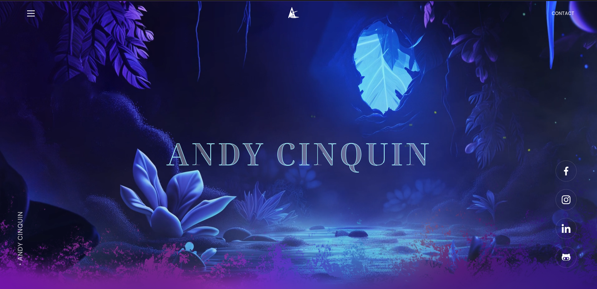

# Andy Cinquin 🐝

## _Hi ! I'm Andy, an Entrepreneur, Freelance Developer, Co-founder of ForHives, ForMenu & Artriste. CEO of My-Makeup._



> **(api github project : <https://github.com/CinquinAndy/API-PortefolioV6>**

## How to run ??

> **(use pnpm // npm // yarn but don't push the lock file)**

### _dev_

```bash
git clone
-> add .env file
pnpm install
pnpm run dev
pnpm run build
```

### _tests_

```bash
pnpm run cypress:run
```

## Tech stack 💻

That is the list of technologies that My portefolio use.

> **Front**
>
> > - [NextJs (ReactJS)](https://nextjs.org/)
> > - [TailwindCSS](https://tailwindcss.com/)
> > - [TailwindUI](https://tailwindui.com/)
> > - [HeadlessUI](https://headlessui.com/)
> > - [NextAuth](https://next-auth.js.org/)
> > - [MailGun](https://www.mailgun.com/)
> > - [Prettier](https://prettier.io/)
> > - [EsLint](https://eslint.org/)
> > - [Husky](https://typicode.github.io/husky/#/)

> **CI**
>
> > - [Cypress](https://www.cypress.io/)

> **CD**
>
> > - GitHub CI
> > - [Renovate](https://www.mend.io/renovate/)

> **Backend**
>
> > - [Strapi](https://strapi.io/)
> > - [PostgreSQL](https://www.postgresql.org/)

> **Serveur**
>
> > - [CapRover](https://caprover.com/)
> > - VPS Linux (Debian)
> > - [Docker](https://www.docker.com/)
> > - [Fail2Ban](https://www.fail2ban.org/wiki/index.php/Main_Page)
> > - [LetsEncrypt](https://letsencrypt.org/)
> > - [UFW](https://doc.ubuntu-fr.org/ufw)
> > - [DNS (OVH / CloudFlare)](https://cloudflare.com/)

> **Monitoring**
>
> > - [NetData](https://www.netdata.cloud/)
> > - [BetterUptime](https://betteruptime.com/)

> **Tools**
>
> > - [OpenCommit](https://github.com/di-sukharev/opencommit)
> > - [Git Kraken](https://www.gitkraken.com/)
> > - [IntelliJ](https://www.jetbrains.com/idea/)
> > - [Wakatime](https://wakatime.com/)
> > - [GitHub Copilot](https://copilot.github.com/)
> > - [ChatGPT](https://chat.openai.com/)
> > - [Syncthings](https://syncthing.net/)
> > - [TinyPNG](https://tinypng.com/)
> > - [cwebp](https://developers.google.com/speed/webp/docs/cwebp)
> > - [PowerToys](https://learn.microsoft.com/en-us/windows/powertoys/)
> > - Google suit
> > - [Insomnia](https://insomnia.rest/) // [Bruno API](https://www.usebruno.com/)
> > - [TMUX](https://tmuxcheatsheet.com/)
> > - [Discord](https://discord.com/)

> **Design**
>
> > - [Adobe Photoshop](https://www.adobe.com/products/photoshop.html)
> > - [Adobe After effect](https://www.adobe.com/products/aftereffects.html)
> > - [Adobe Illustrator](https://www.adobe.com/products/illustrator.html)
> > - [Adobe Firefly](https://www.adobe.com/sensei/generative-ai/firefly.html)
> > - [Figma](https://www.figma.com/)
> > - [MidJourney](https://midjourney.com/)

## File Structure 🗃️

> 📁 _.husky_ : Git hooks  
> 📁 _cypress_ : Cypress configuration (e2e tests)  
> 📁 _public_ : Images, fonts, icons, ...  
> 📁 _src/components_ : Reusable components  
> 📁 _src/pages_ : Pages (use some components to build pages)
>
> > 📁 _src/pages/api_ : API routes (api routes are server-side only routes, on nextJS server)  
> > 📁 _src/pages/api/sendMail_ : API route to send mail  
> > 📁 _src/pages/blog/[slug]_ : Blog page generated by nextJS & Strapi  
> > 📁 _src/pages/portefolio/[slug]_ : Portefolio page generated by nextJS & Strapi  
> > 📁 _src/styles_ : Global styles  
> > 📁 _src/services_ : Services (API, Auth, ...)
